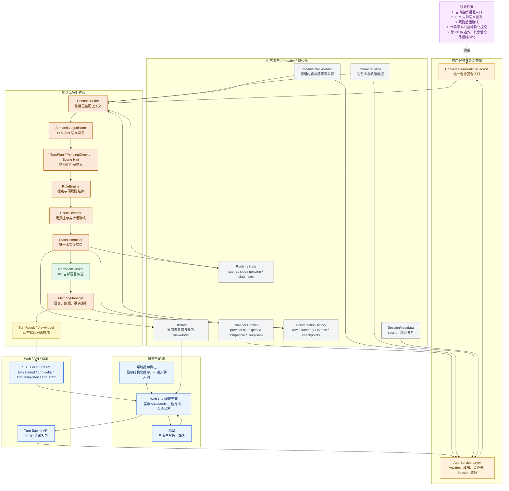

# 黑域边界 Python 主线系统整体架构图

> 用途：当前版本展示素材，概括“自由自然语言输入 -> 语义裁定 -> 规则确认 -> 结构化状态提交 -> KP 叙述输出”的主回合链路。

## 图意

- `ConversationRuntimeFacade` 是唯一回合中枢，Web 与资源装配都不能绕过它直接改世界状态。
- `StateCommitter` 是唯一事实提交口，`RuntimeState / ConversationHistory / UIState` 都通过它落地。
- `NarrationService` 只负责 KP 面向玩家的自然语言输出，其余链路统一走结构化对象。
